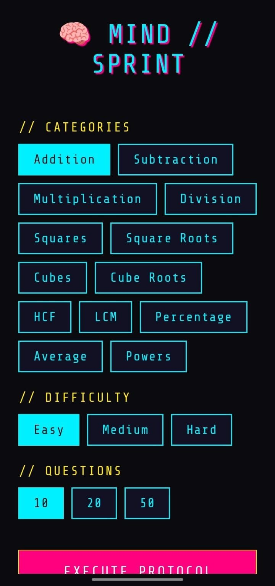

# 🧠 MindSprint

A lightweight mental math training app built with **React Native**, **Expo**, and **TypeScript**.

MindSprint helps improve arithmetic speed and accuracy through customizable practice sessions with instant feedback and a distraction-free experience.

## Features

* Practice across **13 arithmetic categories**:

  * Addition
  * Subtraction
  * Multiplication
  * Division
  * Squares
  * Square Roots
  * Cubes
  * Cube Roots
  * HCF
  * LCM
  * Percentage
  * Average
  * Powers
* Three difficulty levels (Easy, Medium, Hard)
* Custom workout lengths (10, 20, or 50 questions)
* Randomized mixed practice from selected categories
* Instant answer validation
* Automatic progression to the next question
* Live workout progress tracking
* Final score, accuracy, and completion time
* Clean, retro-inspired UI

## Screenshots

| Home                           | Workout                              |
| ------------------------------ | ------------------------------------ |
|  |  |

| Incorrect Answer                         | Result                             |
| ---------------------------------------- | ---------------------------------- |
|  |  |

## Tech Stack

* React Native
* Expo
* TypeScript
* React Navigation

## Project Structure

```text
src/
├── generators/
│   ├── addition.ts
│   ├── subtraction.ts
│   ├── multiplication.ts
│   ├── division.ts
│   ├── squares.ts
│   ├── squareRoots.ts
│   ├── cubes.ts
│   ├── cubeRoots.ts
│   ├── hcf.ts
│   ├── lcm.ts
│   ├── percentage.ts
│   ├── average.ts
│   ├── powers.ts
│   └── index.ts
│
├── screens/
│   ├── HomeScreen.tsx
│   ├── WorkoutScreen.tsx
│   └── ResultScreen.tsx
│
├── constants/
├── navigation/
└── types/
```

## Getting Started

Clone the repository:

```bash
git clone https://github.com/kamalesh2602/MindSprint.git
```

Move into the project:

```bash
cd MindSprint
```

Install dependencies:

```bash
npm install
```

Start the development server:

```bash
npx expo start
```

Build an Android APK:

```bash
eas build --platform android --profile preview
```

## Future Improvements

* Timed Challenge mode
* Daily challenges
* Session history
* Personal best tracking
* Streak system
* Achievements
* Additional practice modes

## Repository

GitHub: https://github.com/kamalesh2602/MindSprint
